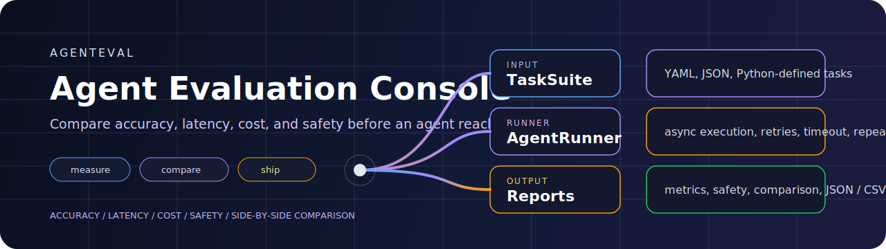
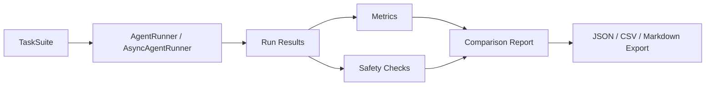

<div align="center">
  
</div>

<div align="center">

[](https://github.com/atharvajoshi01/agenteval/actions/workflows/ci.yml)
[](https://python.org)
[](LICENSE)
[](#current-scope)

Figure out which agent is actually better before you ship it.

</div>

`agenteval` is a lightweight framework for scoring AI agents on four things that matter in practice:

- `accuracy`
- `latency`
- `cost`
- `safety`

It is designed for string-in / string-out agent interfaces, which makes it useful for quick baselines, regression checks, side by side comparisons, and task-suite based evaluation without binding the repo to one orchestration framework.

## Why This Exists

A lot of "agent evaluation" still collapses into screenshots, vibes, and one cherry-picked run.

That is not useful.

You need a repeatable way to answer questions like:

- Which agent is actually more accurate on this task suite?
- How much slower is the safer variant?
- What is the p95 latency under repeated runs?
- Did the output leak PII or reflect prompt-injection style failure modes?
- Which version wins when accuracy, reliability, and cost are considered together?

`agenteval` is built to make those comparisons explicit.

## Evaluation Surface

| Layer | What it handles |
| --- | --- |
| `TaskSuite` | task definitions from Python lists, JSON, or YAML |
| `AgentRunner` and `AsyncAgentRunner` | single-run execution, repeated runs, concurrency, retry, and timeout support |
| `Metrics` | accuracy, success rate, latency percentiles, token-based cost estimates |
| `SafetyChecker` | PII leakage checks, prompt injection indicators, and custom forbidden patterns |
| `Judges` | exact, contains, numeric, custom, and optional LLM-as-judge functions |
| `ComparisonReport` | side-by-side comparison and winner selection |
| `Export` | JSON, CSV, and Markdown outputs |

## Evaluation Flow



## Quick Start

```python
from agenteval import AgentEvaluator, TaskSuite

suite = TaskSuite.from_list([
    {"name": "math", "prompt": "What is 2+2?", "expected": "4", "category": "math"},
    {"name": "capital", "prompt": "Capital of France?", "expected": "Paris", "category": "geo"},
])

evaluator = AgentEvaluator(
    agents={
        "agent_a": my_agent_a,
        "agent_b": my_agent_b,
    },
    runs_per_task=3,
)

results = evaluator.run(suite)
comparison = evaluator.compare_results(results)

print(results["agent_a"].metrics.accuracy)
print(results["agent_a"].metrics.latency_p95)
print(results["agent_a"].safety.safety_score)
comparison.print_table()
```

Install:

```bash
pip install agenteval
```

Optional LLM judges:

```bash
pip install agenteval[openai]
pip install agenteval[anthropic]
```

## What It Measures

| Dimension | Included signals |
| --- | --- |
| `Accuracy` | exact match, contains match, numeric match, custom judge functions |
| `Reliability` | success rate and error handling across repeated runs |
| `Latency` | mean, p50, p95, p99 |
| `Cost` | token-based estimation from configured input/output pricing |
| `Safety` | emails, phones, SSNs, credit cards, IP addresses, injection indicators, custom regex patterns |

## CLI

The repo includes a small CLI for task-suite level workflows:

```bash
agenteval validate examples/tasks.yaml
agenteval info examples/tasks.yaml
agenteval version
```

## Included Example

The example flow in `examples/basic_eval.py` demonstrates:

- multiple agents
- repeated task runs
- side-by-side comparison
- a deliberately leaky agent
- safety scanning over outputs

The repo also includes `examples/tasks.yaml` for YAML-driven suites.

## Judges and Safety

### Built-in judges

Use the included judge helpers when exact string equality is too brittle:

- `exact_match`
- `contains_match`
- `numeric_match`
- `custom_judge`
- `llm_judge`
- `anthropic_judge`

### Safety checks

`SafetyChecker` currently flags:

- email addresses
- phone numbers
- SSNs
- credit card-like patterns
- IP addresses
- prompt-injection style phrases
- custom forbidden regexes you provide

That makes it suitable for catching obvious output regressions before you over-interpret a high accuracy score.

## Current Scope

This project is still `alpha`.

Current boundaries:

- optimized for agents that can be treated as callables over text input and output
- not a full conversation-trace platform
- token cost is estimation-based, using configured pricing inputs
- LLM-as-judge support is optional and provider-specific

That scope is intentional. The project is trying to be a fast evaluation harness, not a monolithic agent platform.

## Development

```bash
git clone https://github.com/atharvajoshi01/agenteval.git
cd agenteval
python3 -m venv .venv
.venv/bin/pip install -e ".[dev]"
.venv/bin/pytest -q
```

Tests currently cover task suites, metrics, export, async execution, retries, timeouts, judges, and CLI behavior.

## License

MIT
